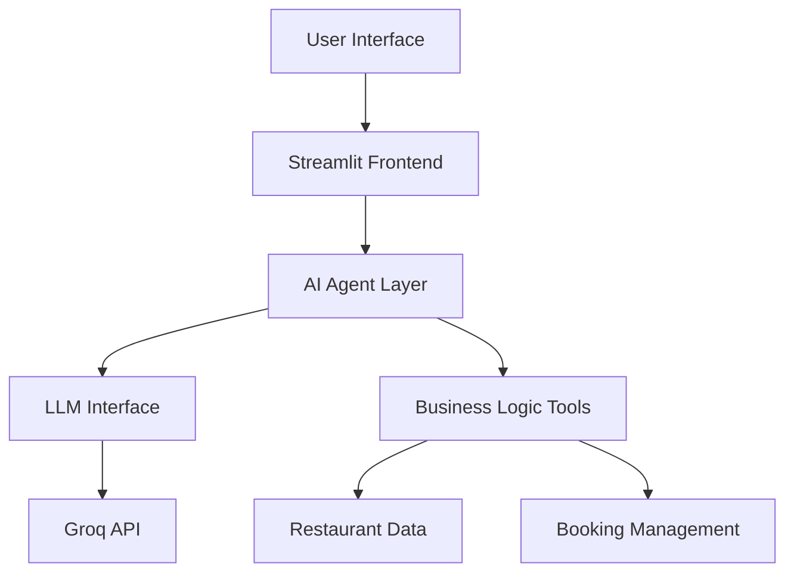

# ReserveMate – AI-Powered Restaurant Reservation System 🍽️

[](https://reserve-mate-csnb6wskwa8p6srtrcbvn8.streamlit.app/)

## 📱 Live Demo
[ReserveMate Live Demo](https://reserve-mate-csnb6wskwa8p6srtrcbvn8.streamlit.app/)

## 🎥 Video Walkthrough
[Coming Soon]

## 🏗️ Architecture



## 🛠️ Tech Stack

### Frontend
- **Streamlit**: Modern web application framework
- **Custom CSS**: Responsive and user-friendly interface
- **HTML/CSS**: Custom styling and components

### Backend
- **Python**: Core programming language
- **Groq API**: Large Language Model integration
- **JSON**: Data storage and management

### AI/ML
- **LLM Integration**: Advanced natural language processing
- **Prompt Engineering**: Optimized conversation flow
- **Tool-Calling System**: Dynamic function execution

## ✨ Features

### 1. Intelligent Restaurant Search
- Multi-criteria search (city, cuisine, location)
- Real-time filtering and ranking
- Smart result presentation

### 2. AI-Powered Booking System
- Natural language conversation
- Context-aware responses
- Intelligent booking management

### 3. Reservation Management
- Create, modify, and cancel bookings
- Real-time availability checking
- Booking history tracking

### 4. User Experience
- Responsive design
- Real-time updates
- Intuitive interface

## 🚀 Setup Instructions

### Prerequisites
- Python 3.8+
- Groq API key
- Git

### Local Development Setup

1. **Clone the repository**
   ```bash
   git clone https://github.com/SriHarshitha88/Reserve-Mate.git
   cd ReserveMate
   ```

2. **Create and activate virtual environment**
   ```bash
   # Windows
   python -m venv venv
   venv\Scripts\activate

   # Mac/Linux
   python -m venv venv
   source venv/bin/activate
   ```

3. **Install dependencies**
   ```bash
   pip install -r requirements.txt
   ```

4. **Set up environment variables**
   Create a `.env` file in the root directory:
   ```
   GROQ_API_KEY=your_groq_api_key_here
   ```

5. **Run the application**
   ```bash
   streamlit run app.py
   ```

### Deployment

#### Streamlit Cloud
1. Fork this repository
2. Create a Streamlit Cloud account
3. Connect your GitHub repository
4. Add your GROQ_API_KEY in the secrets management
5. Deploy!

## 📁 Project Structure
```
ReserveMate/
├── app.py                  # Main Streamlit application
├── agent.py               # AI agent logic
├── tools.py               # Business logic tools
├── tools_schema.py        # Tool schemas for LLM
├── llm_interface.py       # LLM API interface
├── requirements.txt       # Project dependencies
├── assets/               # Static assets
│   └── style.css         # Custom CSS
└── restaurants.json      # Sample restaurant data
```

## 🤝 Contributing
Contributions are welcome! Please feel free to submit a Pull Request.

## 📝 License
This project is licensed under the MIT License - see the LICENSE file for details.

## 🙏 Acknowledgments
- Streamlit team for the amazing framework
- Groq for the LLM API
- All contributors and supporters

---

